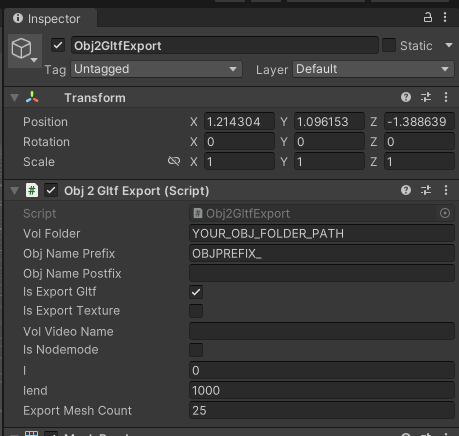

# EXTVolumetricVideoUnity
This is a sample Unity project for the export and import mesh sequence based Volumetric Video glTF file format with [EXT_volumetricvideo](https://github.com/irc-hslu/glTF/tree/EXT_volumetricvideo/extensions/2.0/Vendor/EXT_volumetricvideo). It contains the Volumetric Video glTF exporter/importer modified on top of the official [UnityGLTF plugin](https://github.com/KhronosGroup/UnityGLTF).

## Exporter
[SimpleObjToVVgltf](Assets/SimpleObjToVVgltf.unity) is an example scene with [Obj2GltfExport](Assets/VVglTFScript/Obj2GltfExport.cs) component to export glTF with EXT_volumetricvideo from a sequence of 3D mesh OBJ files. 
First, put all OBJ mesh files to Assets/Resource folder in this Unity project, enable the Read/Write access of all OBJ files in their inspector. All OBJ files should have same pattern of file name, with incremental index number for that mesh frame, and optional, the same prefix / postfix. 
Next, find the Obj2GltfExport game object and change the parameters of Obj2GltfExport component, Below is the configuration for Obj2GltfExport component. 

.
- <kbd>vol Folder</kbd> set to the name of OBJ mesh folder in Resource folder.
- Set <kbd>I</kbd> to the first frame number  and <kbd>Iend</kbd> to the last frame number of your OBJ file name.
- Set <kbd>Obj Name Prefix</kbd> if your OBJ files have the same prefix filename.d
- Set <kbd>Obj Name Postfix</kbd> if your OBJ files have the same postfix filename.
- Check <kbd>Is Export Gltf</kbd> 
- Uncheck <kbd>Is Export Texture</kbd> if you want to apply texture by using video, and only check it if video texture has error. It will embed texture to each mesh frames. The file size of VVgltf will be bigger.
- Set <kbd>Vol Video Name</kbd> to the video filename.
- Set <kbd>Export Mesh Count </kbd> with the number smaller than the total number of OBJ mesh files if you want to seperate the Volumetric Video into multiple glTF chunk files.
The node mode export each mesh in a node, it will display all mesh frames at once.
Finally, Play the scene and wait for the exportation finish. The exported glb folder will be generated on this <kbd>project root / volFolder</kbd> 

Texture video export is not integrated in Unity, please use your own image sequence to video converter.
We use below ffmpeg command line to generate texture video from the texture png image sequence: 
   ```
    ffmpeg -v verbose -framerate 30 -start_number 0 -i '*.png' -c:v libx264 -profile:v baseline -r 30 -pix_fmt yuv420p -colorspace 1 -color_primaries 1 -color_trc 1 output.mp4
   ```

Draco Compression:
Our extension support both Draco compression. The compression tool is not integrated in our example project. We use [gltf-transform](https://gltf-transform.dev/cli) for Draco Compression. Install it on your pc and use below command line to export the compressed Volumetric Video glTF:
   ```
gltf-transform optimize inputfilename.glb output.glb --compress draco --texture-compress webp --flatten false  --join false  --prune false  --prune-attributes false  --prune-leaves false
   ```
It is important to set --prune-attributes to false, it keep the Volumetric Video mesh frame in the file. 

## Importer
[pc](Assets/pc.unity) is an example scene with [VVgltfPlayer](Assets/VVglTFScript/VVgltfPlayer.cs) component to play Volumetric Video glTF. 
Below is the configuration for VVgltfPlayer component to play Volumetric Video correctly:

- <kbd>Gltf File Path</kbd>: set the Volumetric Video glTF file path.
- <kbd>Vol Folder Path Type</kbd>: Choose the type of glTF file path address.
- <kbd>Vol Video Texture Path Type</kbd>: Choose the type of texture video file path type.
- Enable <kbd>Is Looping</kbd> to keep the Volumetric Video repeating, until the scene stop.
- Enable <kbd>Play on Start</kbd> to start the video immediately when the scene start.
- Enable <kbd>Is Runtime Load Mesh </kbd>  if the glTF files is load at runtime, disable it if the Volumetric Video glTF files is in node mode and imported into the project asset folder and inserted to the scene.
- Enable <kbd>Is Sequence</kbd> if the Volumetric Video into multiple glTF chunk files. And Set <kbd>Gltflist</kbd> with a sequence ordered list of file path of the glTF chunk files. 
- Set <kbd>Next Active</kbd> for another VVgltfPlayer game object in the scene if you have two or more Volumetric Videos to play in a scene and your device has slow performance for concurrent loading of glTF files when starting the scene. Unactive all other VVgltfPlayer game objects and set their next VVgltfPlayer game objects to be active in this field.